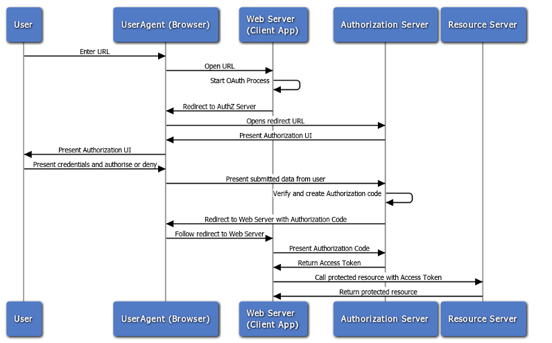

# oauth2_study

oauth2 를 시뮬레이션 합니다. 

oauth2 flow 는 다음의 url 을 참고합니다.

https://docs.oracle.com/cd/E39820_01/doc.11121/gateway_docs/content/oauth_flows.html



### 실행

```docker-compose up --build``` 

### 프로세스

1. app developer 자신의 app 서비스를 authorization 서버에 인증을 받는다. ( client_id, secret_id 발급 )
2. resource owner 가 app client 에 로그인을 요청한다.
3. app client 는 authorization server 에 redirection 시킨다.
4. resource owner 가 id, password 를 입력해 authorization server 에 로그인한다.
5. authorization server 가 app client 에게 authorization code ( token ) 을 전달한다.
6. app client 가 app server 에게 authorization code ( token )  을 전달한다.
7. app server 가 authorization server 에 token 을 전달해 유효한지 검증

